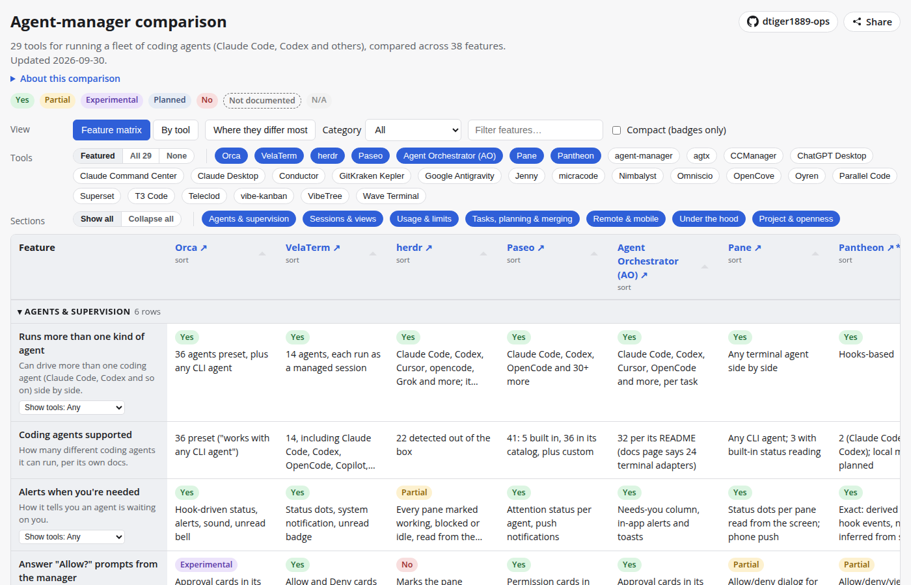

# Agent-manager comparison

A public, sortable comparison table of AI coding-agent managers — tools that supervise a fleet of
coding-agent sessions (Claude Code, Codex, and similar) across usage tracking, task sourcing,
session organization, and remote/mobile access.



## What this is

A single static HTML page (`index.html`) that loads `data/tools.json` and renders it as:

- **Feature matrix** — tools as columns, features as rows, matching the source comparison's cross
  table. Orca is the leftmost column. Click a tool's column header to sort feature rows by that tool's
  mark; click
  "Feature" to reset. A category filter, a feature search box, and a toggle to hide rows where
  every visible tool is "unknown."
- **By tool** — one row per tool (name, category, where agents run, license, checked-on date,
  source note, count of "yes" marks), sortable by any column.

Marks are rendered as small colored badges with text labels, not color alone, and the page works
down to a 390px-wide phone screen with light/dark mode following the OS setting.

## Snapshot and verification caveat

**This is a snapshot as of 2026-09-28.** Every cell comes from each tool's own documentation,
website, or public posts at the date noted for that tool — it has not been independently
re-verified beyond that single pass. Where a tool's own materials don't state something, the cell
reads "unknown" rather than a guess.

**Pantheon is the author's own project** ([open source](https://github.com/dtiger1889-ops/pantheon), pre-release, published as-is) and is scored by exactly the same
rules as every other tool here, including its weak spots (for example: 2 agent harnesses so far,
no native mobile app, a terminal-multiplexer stability issue still open as of the snapshot date).

## How to view it

Open `index.html` directly in a browser, or serve the folder with any static file server, e.g.:

```
python -m http.server 8080
```

then visit `http://localhost:8080/`.

## Data file structure

`data/tools.json`:

- `snapshot_date`, `snapshot_note` — the caveat above, machine-readable.
- `features` — the list of feature rows: `key`, `label`, and a one-line plain-English
  `description`.
- `tools` — one object per tool:
  - `name`, `url` (site or repo, only when the source names one), `category` (`"agent manager"` or
    `"other tool we looked at"`), `where_agents_run`, `license`, `checked_on`, `source_note`,
    `is_authors_own` (`true` only for Pantheon).
  - `features` — a map of feature key to `{ value, mark }`, where `mark` is one of `yes`,
    `partial`, `experimental`, `planned`, `no`, `unknown`, `n/a`.

`data/tools.json` is generated by `tools/build_data.py` from a single source comparison document
(not included in this repo, since it contains unrelated project notes); the script is the record
of exactly how each cell was transcribed. `tools/build_linkedin.py` generates
`assets/linkedin.html`, the source for the LinkedIn image, from the same data file.

## License

MIT — see `LICENSE`.
